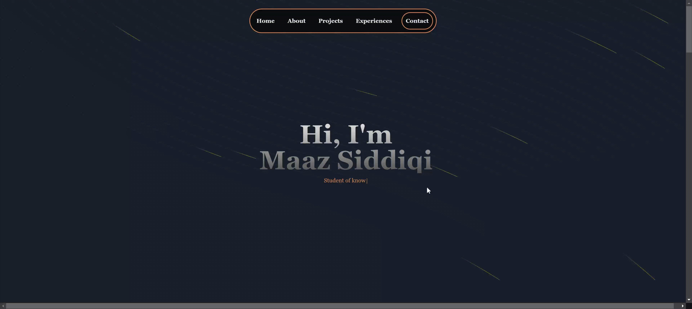

 
    
    
^^^Take a tour of the site^^^

# Introduction
#### This repo showcases the front end of my portfolio website. The website has a client page and an admin CMS for future changes to the content. 

## Tech Stack

**Front-end**

- [React](https://reactjs.org/) with [TypeScript](https://www.typescriptlang.org/) is used for the functionality of the website.
- [TailwindCSS](https://tailwindcss.com/) is used as the UI framework.
- [AceternityUI](https://ui.aceternity.com/) and [NextUI](https://nextui.org/) is used to create some styled UI components.
- [Redux](https://react-redux.js.org/) was used for state management across all components.
- [React-Router-Dom](https://reactrouter.com/en/main) was used for routing.
- [Vite](https://vitejs.dev/) was used as a build tool.

**[Back-end](https://github.com/Maaz-Sidd/Portfolio-backend)**

- [Node.js](https://nodejs.org/en/) with [TypeScript](https://www.typescriptlang.org/) is used for the server environment.
- [Express.js](https://expressjs.com/) as a middleware.
- [MongoDB](https://www.mongodb.com/) for datamanagement and storage.
- [Firebase Storage](https://firebase.google.com/) for storing images.

**Hosting**

- [Google Firebase](https://firebase.google.com/) is used for the client-side hosting
- [Koyeb](https://www.koyeb.com/) is used to host the server.

